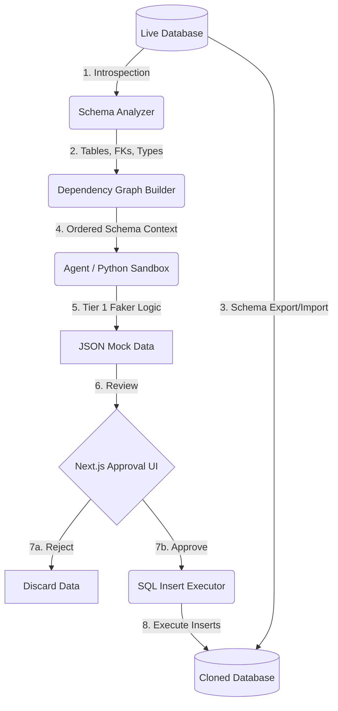

Last verified: 2026-08-28

# Arceus - Agentic Mock Data Generator

## Current Phase: Phase 1 (Schema Introspection) — DONE, awaiting approval to proceed to Phase 2

## Phasing
1. ✅ Schema introspection
2. ⬜ Dependency graph + generation order
3. ⬜ Tier 1 Faker generation respecting types/constraints
4. ⬜ FK-aware value resolution across tables
5. ⬜ Sandbox + schema cloning
6. ⬜ Approval UI
7. ⬜ Insert execution
8. ⬜ (Stretch) Tier 2 sampling, then edge-case mode

## Feature List

### MUST-HAVE (Day 1)
- **DB Connector**: Introspects Postgres & MySQL schemas (tables, columns, types, nullability, foreign keys, unique constraints).
- **Dependency Graph Builder**: Orders table generation so parent tables (referenced by FKs) are generated before child tables.
- **Faker-based Generator (Tier 1)**: Type/name-pattern based field mapping (e.g., email columns get emails, dates respect constraints).
- **FK Resolution**: Child table foreign key columns must reference actual generated/existing IDs from the parent table, not random values.
- **Sandbox Execution & Schema Cloning**: Generation script runs in an isolated sandbox against a CLONED schema created by the tool (never the live/production DB).
- **Approval UI**: Next.js dashboard showing generated rows per table, row counts, a clear "cloned schema target" warning, and Approve/Reject actions.
- **Insert Action**: Executes the SQL inserts against the cloned schema upon approval, showing success/failure counts.

### STRETCH (Day 2 AM - Only after MUST-HAVE is verified)
- **Tier 2 Statistical Sampling**: Sample real value distributions for tables with ≥10 existing rows to bias generation.
- **Edge-case Mode**: Generate N rows designed to break assumptions (nulls, unicode, boundary values, max-length strings, etc.).

## Tech Stack & Justification
- **Frontend**: Next.js (App Router), React, Tailwind CSS.
  *Justification*: Fast interactive dashboard with built-in API routes for backend orchestration.
- **Backend**: Python, `psycopg2`, `Faker`, `networkx`.
  *Justification*: Robust libraries for DB introspection, graph resolution, and data generation.
- **Agent Harness**: TrueForge (via `npx @truefoundry/trueforge`) + MCP.
  *Justification*: MCP standardizes the agent's interaction with the database. TrueForge provides sandbox execution.
- **Database**: PostgreSQL (primary target), MySQL (secondary).

## Data Flow Diagram
